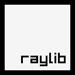

# 🐺🌕 Hello world!

I am an independent software and mobile game developer that loves high expressibility using lower level programming languages,
striving for speed and efficiency with deep understanding of the underlying system.

_"If we never dared to reinvent the wheel, we would still be riding horse carriages."_

## Portfolio

<table>
  <thead>
    <tr>
      <th>Title</th>
      <th>Description</th>
      <th>Tech</th>
      <th>Platform</th>
      <th>Year</th>
    </tr>
  </thead>
  <tbody>
    <tr>
      <td><a href="https://play.google.com/store/apps/details?id=com.doomhowl.blasteroids">Blasteroids!</a></td>
      <td>Mobile <a href="https://en.wikipedia.org/wiki/Asteroids_(video_game)">'Asteroids'</a> inspired arcade game</td>
      <td>
        
        
      </td>
      <td>
         
        
        
      </td>
      <td>2023</td>
    </tr>
    <tr>
      <td><a href="https://play.google.com/store/apps/details?id=com.doomhowl.vortex">Vortex</a></td>
      <td>Hypercasual endless mobile dodging game</td>
      <td>
        
        
        
        
      </td>
      <td>
        
        
      </td>
      <td>2024</td>
    </tr>
    <tr>
      <td>Space Typer</td>
      <td>Mobile typing speed practice game with multiplayer mode</td>
      <td>
        
        
        
        
        
        
        
        
      </td>
      <td>
        
        
      </td>
      <td>Soon™</td>
    </tr>
  </tbody>
</table>

## Toolbox

<table>
  <tr>
    <th>
      Languages
    </th>
    <td style="vertical-align: bottom;">
      
      
      
    </td>
    <td style="vertical-align: bottom;">
      
      
      
      
    </td>
  </tr>
  <tr>
    <th>
      Frameworks
    </th>
    <td style="vertical-align: bottom;">
      
      
    </td>
    <td style="vertical-align: bottom;">
      
      
      
    </td>
  </tr>
</table>

## Links

 [Youtube](https://www.youtube.com/@brambasiel) 
 [Twitch](https://www.twitch.tv/brambasiel)
