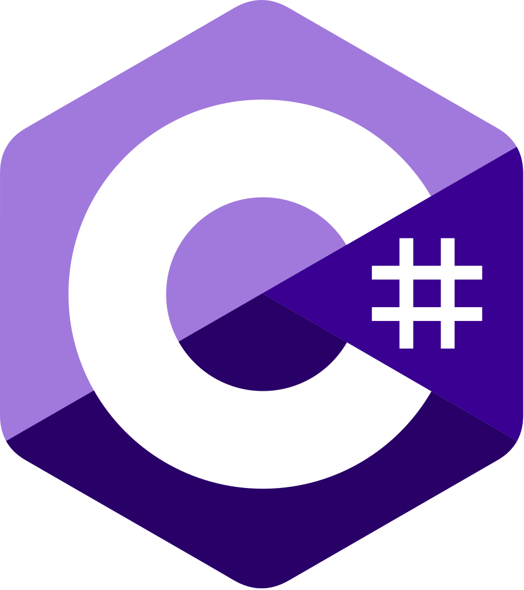

# 🐺🌕 Hello world!

I am an independent software and mobile game developer that loves high expressibility using lower level programming languages,
striving for speed and efficiency with deep understanding of the underlying system.

_"If we never dared to reinvent the wheel, we would still be riding horse carriages."_

## Portfolio

<table _ngcontent-ng-c3145346199="" id="portfolioTable" style="width: 100%;"><thead _ngcontent-ng-c3145346199=""><tr _ngcontent-ng-c3145346199=""><th _ngcontent-ng-c3145346199="">Title</th><th _ngcontent-ng-c3145346199="">Description</th><th _ngcontent-ng-c3145346199="">Tech</th><th _ngcontent-ng-c3145346199="">Platform</th><th _ngcontent-ng-c3145346199="">Year</th></tr></thead><tbody _ngcontent-ng-c3145346199=""><tr _ngcontent-ng-c3145346199=""><td _ngcontent-ng-c3145346199="">
Space Typer
<!--bindings={
  "ng-reflect-ng-if": "false"
}--></td><td _ngcontent-ng-c3145346199="">Singleplayer and multiplayer typing speed game.</td><td _ngcontent-ng-c3145346199=""><!--bindings={}--><!--bindings={
  "ng-reflect-ng-if": "true"
}--><!--ng-container--><!--bindings={
  "ng-reflect-ng-if": "https://raylib.com"
}--><!--bindings={
  "ng-reflect-ng-if": "false"
}--><!--ng-container--><!--bindings={
  "ng-reflect-ng-for-of": "[object Object],[object Object"
}--></td><td _ngcontent-ng-c3145346199=""><!--bindings={
  "ng-reflect-ng-for-of": ""
}--></td><td _ngcontent-ng-c3145346199="">Soon™</td></tr><tr _ngcontent-ng-c3145346199=""><td _ngcontent-ng-c3145346199="">
Vortex
<a _ngcontent-ng-c3145346199="" target="_blank" href="https://play.google.com/store/apps/details?id=com.doomhowl.vortex"><!--bindings={
  "ng-reflect-ng-if": "https://doomhowl-interactive.c"
}--></a><!--bindings={
  "ng-reflect-ng-if": "true"
}--></td><td _ngcontent-ng-c3145346199="">Hypercasual endless mobile dodging game.</td><td _ngcontent-ng-c3145346199=""><!--bindings={}--><!--bindings={
  "ng-reflect-ng-if": "true"
}--><!--ng-container--><!--bindings={
  "ng-reflect-ng-if": "https://raylib.com"
}--><!--bindings={
  "ng-reflect-ng-if": "false"
}--><!--ng-container--><!--bindings={
  "ng-reflect-ng-if": "https://pixabay.com/service/ab"
}--><!--bindings={
  "ng-reflect-ng-if": "false"
}--><!--ng-container--><!--bindings={
  "ng-reflect-ng-for-of": "[object Object],[object Object"
}--></td><td _ngcontent-ng-c3145346199=""><!--bindings={
  "ng-reflect-ng-for-of": "[object Object]"
}--></td><td _ngcontent-ng-c3145346199="">2024</td></tr><tr _ngcontent-ng-c3145346199=""><td _ngcontent-ng-c3145346199="">
Blasteroids!
<a _ngcontent-ng-c3145346199="" target="_blank" href="https://play.google.com/store/apps/details?id=com.doomhowl.blasteroids"><!--bindings={
  "ng-reflect-ng-if": "https://doomhowl-interactive.c"
}--></a><!--bindings={
  "ng-reflect-ng-if": "true"
}--></td><td _ngcontent-ng-c3145346199="">Mobile 'Asteroids' inspired arcade game.</td><td _ngcontent-ng-c3145346199=""><!--bindings={}--><!--bindings={
  "ng-reflect-ng-if": "true"
}--><!--ng-container--><!--bindings={
  "ng-reflect-ng-if": "https://libgdx.com/"
}--><!--bindings={
  "ng-reflect-ng-if": "false"
}--><!--ng-container--><!--bindings={
  "ng-reflect-ng-for-of": "[object Object],[object Object"
}--></td><td _ngcontent-ng-c3145346199=""><!--bindings={
  "ng-reflect-ng-for-of": "[object Object],[object Object"
}--></td><td _ngcontent-ng-c3145346199="">2023</td></tr><!--bindings={
  "ng-reflect-ng-for-of": "[object Object],[object Object"
}--></tbody></table>

## Toolbox

<table>
  <tr>
    <th>
      Languages
    </th>
    <td style="vertical-align: bottom;">
      
      
      
    </td>
    <td style="vertical-align: bottom;">
      
      
      
      
    </td>
  </tr>
  <tr>
    <th>
      Frameworks
    </th>
    <td style="vertical-align: bottom;">
      
      
    </td>
    <td style="vertical-align: bottom;">
      
      
      
    </td>
  </tr>
</table>

## Gamedev commit chart

<picture>
  <source srcset="https://git.doomhowl-interactive.com/commitchart/2025.png?darkMode=true" media="(prefers-color-scheme: dark)">
  
</picture>

  
2024

  <picture>
    <source srcset="https://git.doomhowl-interactive.com/commitchart/2024.png?darkMode=true" media="(prefers-color-scheme: dark)">
    
  </picture>

## Links

 [Youtube](https://www.youtube.com/@brambasiel) 
 [Twitch](https://www.twitch.tv/brambasiel)
